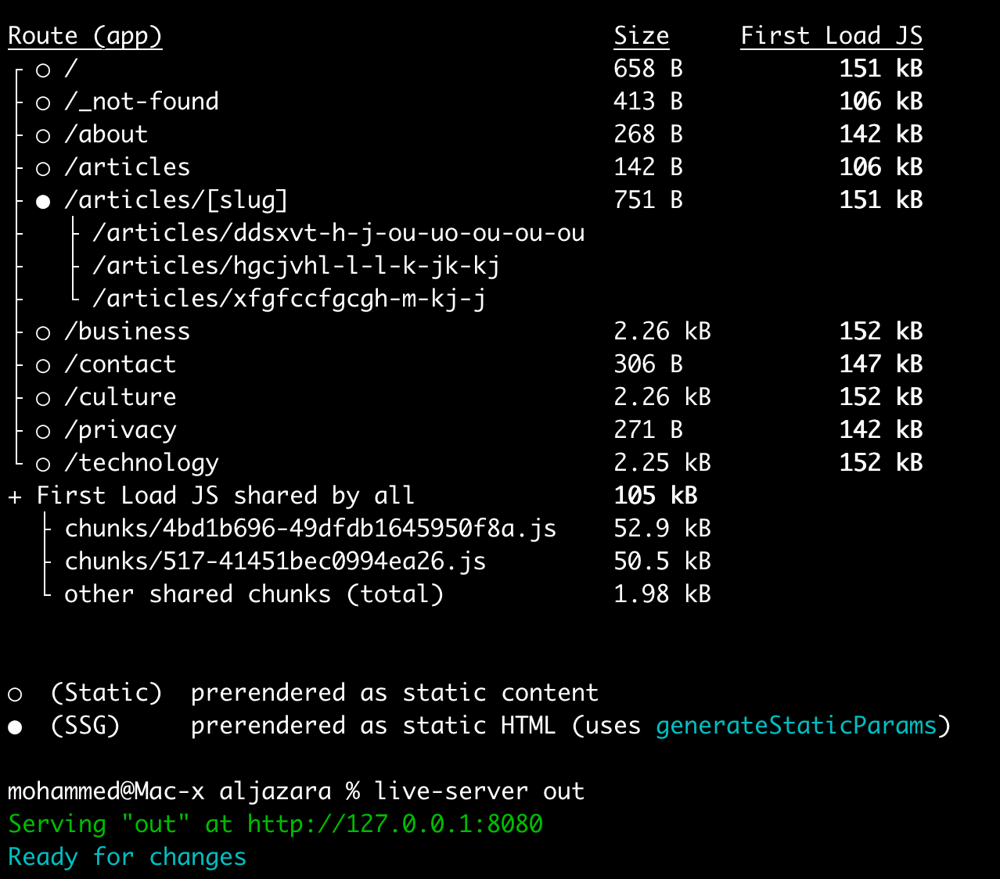

# ▲ Aljazara News Website

🔗 visit [https://aljazara.com](https://aljazara.com)


 

<div align='center' style="border:0.3px solid #ddd; border-radius:8px; padding: 12px;">
  
</div>

<br>

# 🚀 Getting Started

```sh
git clone https://github.com/zaqoutm/aljazara.git
cd aljazara
npm install
```

## # Run with "Directus" app

1. We need Directus app running `https://your-api-url`
2. Set .env variables

`NEXT_PUBLIC_API_PATH=http://localhost:8055/items`
`CURRENT_IMPL=directus`

3. Update next.config.ts remove `output: 'export'`, or just comment it out `//`

> npm run dev http://localhost:3000/

## # Try with `fakerjs`

1. Enable app route `/src/app/_api` to `.../api`

just rename the folder, remove the underscore \_

2. `next.config.ts` disable `output: 'export'`

> npm run dev http://localhost:3000/

<br/>

# 👷‍♀️ Build .ssg

(SSG) Static Site Generation

- Enable `output:'export'` in next.config.ts
- Remove or hide `src/app/api` adding \_ `.../_api`
- Set .env variables

`NEXT_PUBLIC_API_PATH=http://localhost:8055/items`
`CURRENT_IMPL=directus`

```sh
npm run lint
npm run build
```

<div align='center' style="border:0.3px solid #ddd; border-radius:8px; padding: 12px;">
  
</div>
<br/>

Try `live-server out` http://127.0.0.1:8080

<br/>

# 🛠️ Tech stack

- ▲ Next.js 15.1.6
- React 19
- motion
- fakerjs
- moment

`src/app/api/articles/route.ts`

http://localhost:3000/api/articles/

## License

📄 License MIT License © 2025
📬 Contact Email: mo.zaqout@gmail.com

<div style="  text-align: center;">
  Built with ❤️ by Mohammed
</div>
</div>
