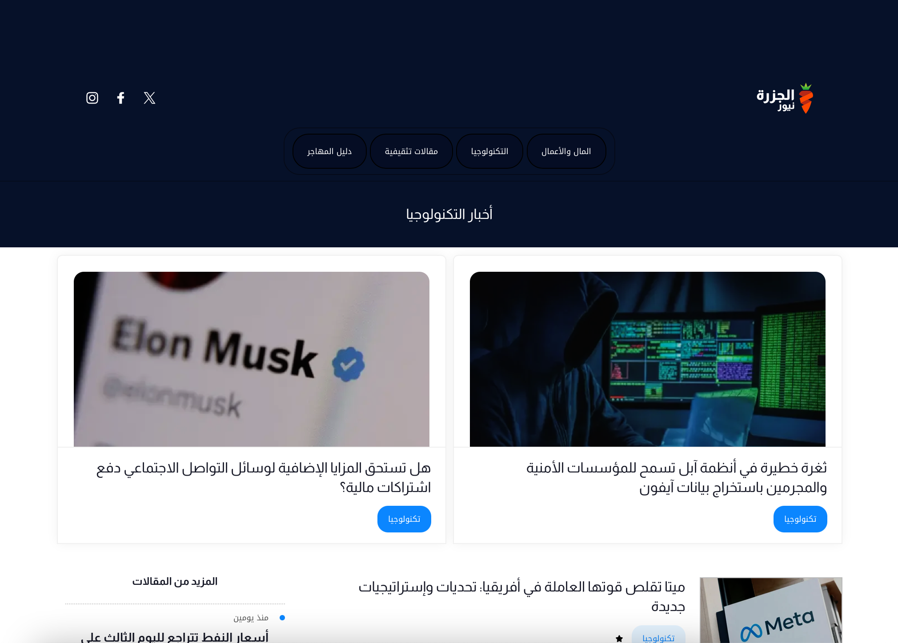
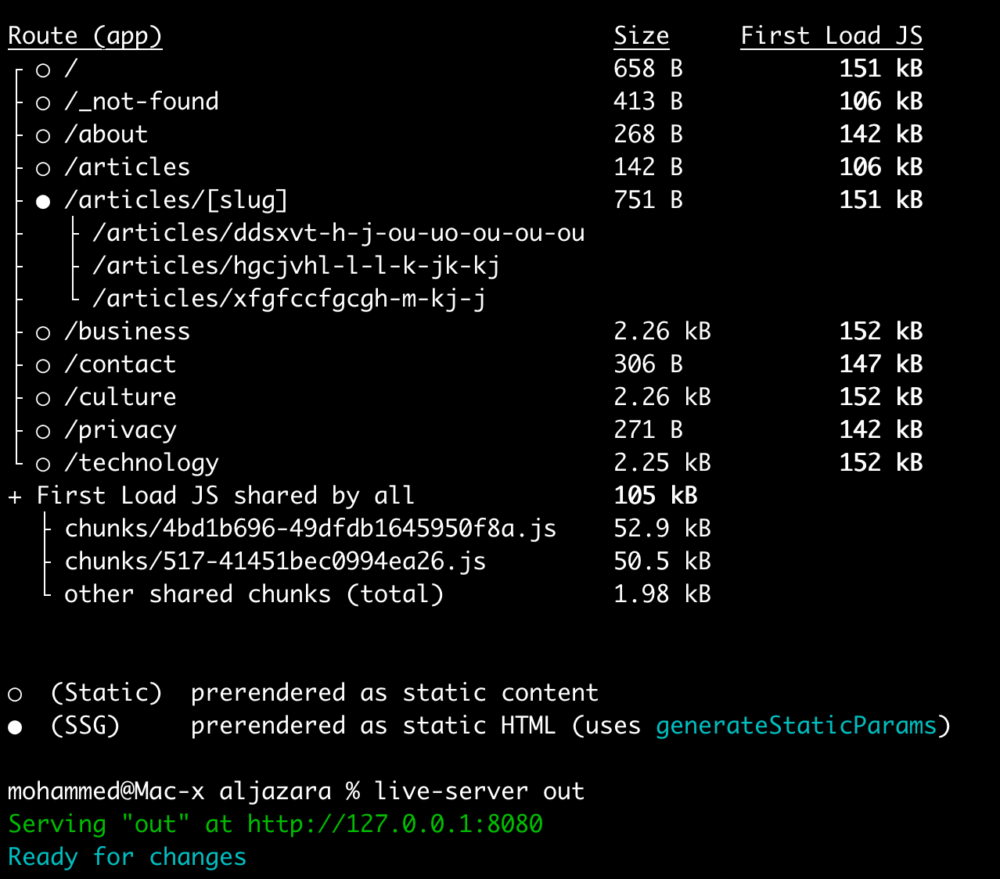

# ▲ Aljazara News Website

🔗 visit [https://aljazara.com](https://aljazara.com)


 

<div align='center' style="border:0.3px solid #ddd; border-radius:8px; padding: 12px;">
  
</div>

<br>

# 🚀 Getting Started

```sh
git clone https://github.com/zaqoutm/aljazara.git
cd aljazara
npm install
```

## Data

`default` faker

#### 1. faker js

- enable app route `/src/app/_api` to `.../api`
- disable `output: 'export'` in `next.config`

#### 2. Markdown files

md files in the root dir
`/data/posts/`

organized by date

```sh
- 2025
  - 01
    - first-post
      - index.md
    ....
  - 02
- 2026
```

index.md structure

```md
---
title: 'Hello world'
date: '2026-01-03'
excerpt: 'description or second title'
category: 'tech'
tags: ['tag1', 'tag2']
---

the rest of the article
```

#### 3. Run with "Directus cms"

- we need Directus app running `https://your-api-url`

- `.env`

```sh
 NEXT_PUBLIC_API_PATH=http://localhost:8055/items
 CURRENT_IMPL=directus
```

- update next.config.ts remove `output: 'export'`, or just comment it out `//`

<br/>

# 👷‍♀️ Build

(SSG) Static Site Generation

- Enable `output:'export'` in next.config.ts
- Remove or hide `src/app/api` adding \_ `.../_api`
- Set .env variables

`NEXT_PUBLIC_API_PATH=http://localhost:8055/items`
`CURRENT_IMPL=directus`

```sh
npm run lint
npm run build && npm run postbuild
```

<div align='center' style="border:0.3px solid #ddd; border-radius:8px; padding: 12px;">
  
</div>
<br/>

Try `live-server out` http://127.0.0.1:8080

<br/>

# 🛠️ Tech stack

```sh
> Node v22.13.1 Maintenance LTS
> npm 11.4.2
```

- ▲ Next.js 15.1.6
- React 19
- motion
- fakerjs
- moment
- gray-matter
- html-react-parser
- rehype-external-links
- rehype-raw
- rehype-stringify
- remark
- remark-html
- remark-rehype

# License

📄 License MIT License © 2025
📬 Contact Email: mo.zaqout@gmail.com

<div style="  text-align: center;">
  Built with ❤️ by Mohammed
</div>
</div>
